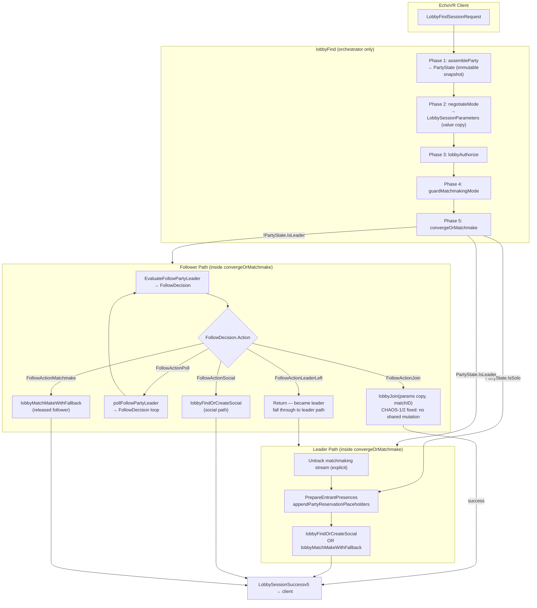

# ADR-001: Party Matchmaking Convergence Redesign

- **Status:** Proposed
- **Date:** 2026-05-17
- **Author:** Sanjay "Blueprints" Patel, principal architect, sprock.io
- **Reviewers:** Pending — high-scale design review with defensive architect required before approval
- **Supersedes:** N/A
- **Related:** `server/qa-report.json` (CHAOS-1, CHAOS-2, CHAOS-3), Grace Liu smell annotations in `evr_lobby_find.go`

---

## Context

### What the system does today

`lobbyFind` (`evr_lobby_find.go:31`) is the single entry point for every client-initiated lobby search. It is approximately 1,400 lines and performs, in sequence:

1. **Party resolution** — `configureParty` (line 43) joins or creates a nakama `PartyHandler`, tracks the leader on a matchmaking presence stream, waits for followers to assemble, and returns `(*LobbyGroup, []uuid.UUID, bool, error)`.
2. **Mode synchronisation** — `isLeaderHeadingToSocial` (line 61) inspects tracker state to detect whether the leader's intent is social, then mutates `lobbyParams.Mode` on the follower.
3. **Authorization** — `lobbyAuthorize` (line 69) validates guild membership.
4. **Mode guard** — a `switch` on `lobbyParams.Mode` (line 74) rejects private/unloaded modes before matchmaking.
5. **Follower convergence** — `TryFollowPartyLeader` (line 94) attempts to join the leader's current match. On failure it calls `pollFollowPartyLeader` (line 143) and on certain outcomes it mutates `lobbyParams.Mode` as a side-effect.
6. **Matchmaking** — falls through to either `lobbyFindOrCreateSocial` or `lobbyMatchMakeWithFallback` depending on `lobbyParams.Mode`.

`TryFollowPartyLeader` (`evr_lobby_find.go:1009`) and `lobbyJoin` (`evr_lobby_join.go:20`) both mutate the shared `*LobbySessionParameters` that every party member's goroutine holds a pointer to.

### Why it is breaking

**CHAOS-1 (CONFIRMED RACE, `evr_lobby_join.go:30-31`).**
`lobbyJoin` writes two fields on the shared params pointer without synchronisation:

```go
lobbyParams.GroupID = label.GetGroupID()   // line 30
lobbyParams.Mode = label.Mode              // line 31
```

When multiple follower goroutines call `TryFollowPartyLeader` with the same `*LobbySessionParameters` (which `lobbyFind` does — the pointer originates from `NewLobbyParametersFromRequest` and is shared via `context.Value`), these are unsynchronised write-write races. The `-race` detector confirms them.

**CHAOS-2 (CONFIRMED RACE, `evr_lobby_find.go:1119`, `evr_lobby_join.go:31`).**
`LobbySessionParameters.Mode` is a plain `evr.Symbol` (`uint64`). It is mutated by `TryFollowPartyLeader` (line 1119: `params.Mode = evr.ModeSocialPublic`) and by `lobbyJoin` (line 31: `lobbyParams.Mode = label.Mode`). `lobbyFind` reads it at line 74-78 in a non-atomic `switch`. Grace Liu's annotation (SMELL H7) documented the hidden side-effect; Tommy's chaos suite confirmed the actual memory race between concurrent goroutines.

**CHAOS-3 (BUG, `evr_lobby_find.go:1137`).**
`TryFollowPartyLeader` does not check `ctx.Err()` before calling `lobbyJoin`. A pre-cancelled context passes through to `lobbyJoin → lobbyAuthorize`, which panics on nil metrics in test and issues unnecessary network calls in production. The 3-second `time.After` in the background goroutine inside `lobbyJoin` further blocks cleanup.

**SMELL at line 49 — deferred Untrack.**
The leader's matchmaking stream presence is untracked via `defer` at function exit (line 51-57). Because `defer` executes after `lobbyFind` returns — which can be well after the leader has joined a match — followers observing the matchmaking stream in `TryFollowPartyLeader` (line 1034) can see a stale presence through the entire duration of matchmaking. The TOCTOU window is bounded only by `lobbyFind`'s lifetime, which can be several minutes.

**SMELL at lines 111-112 — predicate duplication.**
`shouldFollowerFindOrCreateSocial` is defined at line 26-28 as a named function. The inline predicate at line 111, and at lines 122, 167, 272, and 901 (inside `isLeaderHeadingToSocial`), reproduce the same `mode == evr.ModeSocialPublic || mode == evr.ModeSocialNPE` expression. A mode set change (e.g. adding `ModeSocialPrivateSeasonal`) must be applied in all six locations simultaneously. The chaos suite confirms that test isolation is insufficient to catch divergence across six sites.

**Structural debt.**
`lobbyFind` has been the target of eight or more patches in two months. Its control flow has seven distinct `return` paths for followers alone, not counting leader paths and fall-throughs. The function violates the Single Responsibility Principle across at minimum four distinct concerns: party assembly, mode negotiation, follower convergence, and matchmaking. Each patch adds a conditional branch; none of them refactors the structure. Production party splits are a consequence.

### Constraints

1. **EchoVR client protocol.** Clients emit `LobbyFindSessionRequest` and `LobbyJoinSessionRequest`. The server cannot alter client protocol messages. The server must respond with `LobbySessionSuccessv5` or `LobbySessionFailurev3`. This protocol is fixed.
2. **Nakama tracker API.** The tracker is not under our control. `tracker.Track`, `tracker.Untrack`, and `tracker.GetLocalBySessionIDStreamUserID` are the only observer primitives available. The tracker does not support atomic compare-and-swap of presence state. Presence reads are point-in-time snapshots; there is no subscription or watch mechanism. All TOCTOU risks between a tracker read and a subsequent action are inherent to the API.
3. **Party presence semantics.** `PartyHandler` is the nakama-managed party primitive. Leadership is determined by `ph.leader`, which is protected by `ph.RLock/RUnlock` (correctly, per the passing test `TestRace_LobbyGroup_ConcurrentGetLeaderAndSetLeader`). Leader identity can change mid-function; every read of `lobbyGroup.GetLeader()` is a fresh snapshot and must be treated as tentative.
4. **Per-session goroutine model.** Each connected session runs `lobbyFind` in its own goroutine. Followers sharing a party group each call `lobbyFind` independently. There is no shared coordinator goroutine managing the party as a unit. This is an architectural given; the redesign must work within it.

---

## Decision

Redesign the party convergence subsystem by applying three coordinated changes:

1. **Decompose `lobbyFind` into a pipeline of named phases**, each with a single responsibility.
2. **Make `TryFollowPartyLeader` a pure decision function** separated from the join action.
3. **Eliminate shared `*LobbySessionParameters` mutation** from all convergence functions.

### 1. Decompose `lobbyFind` into named phases

Replace the current monolith with the following call sequence, each implemented as a separate, testable function:

```go
func (p *EvrPipeline) lobbyFind(
    ctx context.Context,
    logger *zap.Logger,
    session *sessionWS,
    lobbyParams *LobbySessionParameters,
) error {
    // Phase 1: Party assembly
    party, err := p.assembleParty(ctx, logger, session, lobbyParams)
    if err != nil {
        return err
    }

    // Phase 2: Mode negotiation (read-only on lobbyParams, returns resolved params)
    resolved, err := p.negotiateMode(ctx, logger, session, lobbyParams, party)
    if err != nil {
        return err
    }

    // Phase 3: Authorization (uses resolved, not lobbyParams)
    if err := p.lobbyAuthorize(ctx, logger, session, resolved); err != nil {
        return err
    }

    // Phase 4: Mode guard
    if err := guardMatchmakingMode(resolved.Mode); err != nil {
        return err
    }

    // Phase 5: Convergence (followers) or matchmaking (leader/solo)
    return p.convergeOrMatchmake(ctx, logger, session, resolved, party)
}
```

Key contracts:
- `assembleParty` returns `*PartyState` (defined below). It does not mutate `lobbyParams`.
- `negotiateMode` returns a new `LobbySessionParameters` value (not a pointer) containing the resolved mode, level, and group. It does not mutate the input.
- `convergeOrMatchmake` receives an owned copy of `LobbySessionParameters`; any mutation is local to that goroutine.

### 2. Introduce `PartyState` — an immutable party snapshot

Replace the current triple return `(*LobbyGroup, []uuid.UUID, bool)` with a structured type:

```go
// PartyState is an immutable snapshot of party membership at the moment
// assembleParty completes. It is safe to read from multiple goroutines
// concurrently; it is never written after construction.
type PartyState struct {
    Group            *LobbyGroup  // nil for solo players
    MemberSessionIDs []uuid.UUID  // all members including self; nil for solo
    IsLeader         bool
    Size             int          // cached at assembly time; use for slot math
}

func (ps *PartyState) IsSolo() bool  { return ps == nil || ps.Group == nil }
func (ps *PartyState) HasParty() bool { return !ps.IsSolo() }
```

`assembleParty` constructs this snapshot once. Subsequent phases read from it; they do not re-query `lobbyGroup.GetLeader()` or `lobbyGroup.Size()` except where explicitly noted as requiring a fresh read (and those sites must document the TOCTOU risk).

### 3. Make `TryFollowPartyLeader` a pure decision function

Split the current function into two distinct operations:

```go
// FollowDecision is the outcome of evaluating whether a follower can join
// the leader's match right now.
type FollowDecision struct {
    // Action is what the follower should do next.
    Action FollowAction
    // TargetMatchID is the match to join. Valid only when Action == FollowActionJoin.
    TargetMatchID MatchID
    // OverrideMode is the resolved mode the follower should use.
    // Valid only when Action == FollowActionOverrideMode.
    OverrideMode evr.Symbol
}

type FollowAction int

const (
    // FollowActionJoin — caller should call lobbyJoin with TargetMatchID.
    FollowActionJoin FollowAction = iota
    // FollowActionPoll — leader is matchmaking; caller should poll.
    FollowActionPoll
    // FollowActionSocial — follower should find-or-create social independently.
    FollowActionSocial
    // FollowActionMatchmake — follower is released to independent matchmaking.
    FollowActionMatchmake
    // FollowActionLeaderLeft — caller is now the leader; fall through.
    FollowActionLeaderLeft
)

// EvaluateFollowPartyLeader determines what a follower should do without
// performing any action. It reads tracker state and the match registry
// but does not mutate lobbyParams, does not call lobbyJoin, and does not
// block. It is safe to call from multiple goroutines concurrently with
// different lobbyParams copies.
//
// The caller is responsible for acting on the returned FollowDecision.
func (p *EvrPipeline) EvaluateFollowPartyLeader(
    ctx context.Context,
    logger *zap.Logger,
    session *sessionWS,
    params LobbySessionParameters, // passed by value — read-only
    lobbyGroup *LobbyGroup,
) (FollowDecision, error) { ... }
```

`EvaluateFollowPartyLeader` replaces the "should I follow?" logic in the current `TryFollowPartyLeader`. It returns a `FollowDecision` value. The caller — `convergeOrMatchmake` — acts on that decision. The join, the mode override, and the poll loop all remain outside this function.

The current mutation at line 1119 (`params.Mode = evr.ModeSocialPublic`) becomes `return FollowDecision{Action: FollowActionSocial}, nil` with no write to any shared state.

### 4. `lobbyJoin` takes explicit parameters, not a shared pointer

Replace:

```go
func (p *EvrPipeline) lobbyJoin(
    ctx context.Context,
    logger *zap.Logger,
    session *sessionWS,
    lobbyParams *LobbySessionParameters, // ← mutated at lines 30-31
    matchID MatchID,
) error
```

With:

```go
// lobbyJoin joins matchID using the provided params snapshot.
// It does not mutate params. GroupID and Mode are derived from the match
// label and passed to lobbyAuthorize as local values only.
func (p *EvrPipeline) lobbyJoin(
    ctx context.Context,
    logger *zap.Logger,
    session *sessionWS,
    params LobbySessionParameters, // passed by value — caller's copy is safe
    matchID MatchID,
) error
```

`lobbyAuthorize` is called with a locally-constructed copy of params that has `GroupID` and `Mode` set from the label. This eliminates CHAOS-1 and CHAOS-2 at the root. No caller needs to observe the mutation because `lobbyJoin` is a terminal action in every code path.

Additionally, `lobbyJoin` must return its error to the caller rather than silently returning `nil` (current SMELL at line 56-72). The goroutine sending the client error message is retained; the function must also return the error upward.

### 5. Fix the deferred Untrack (SMELL at line 49)

Remove the `defer` for `tracker.Untrack` of the matchmaking stream (lines 51-57). Replace with an explicit call immediately before any terminal action (match join or matchmaking submission) in the leader's code path:

```go
// In convergeOrMatchmake, leader path, before lobbyMatchMakeWithFallback or
// lobbyFindOrCreateSocial:
p.nk.tracker.Untrack(session.id, mmStream, session.userID)
// — then proceed to matchmaking.
```

If `lobbyFind` returns with an error before reaching a terminal action, the matchmaking stream presence must still be removed. This is handled by a single unconditional `defer` at the top of `assembleParty` — but only registering the Untrack if tracking was successful. The defer scope is now `assembleParty`, not `lobbyFind`, so it executes before follower goroutines have advanced past `TryFollowPartyLeader`.

Constraint: Because `tracker.Untrack` is synchronous in the nakama API, explicit pre-terminal cleanup is safe. The remaining TOCTOU window (follower reads stale presence between explicit Untrack and the tracker propagating the removal) is inherent to the nakama tracker API and cannot be eliminated. It must be documented at the call site.

### 6. Consolidate `shouldFollowerFindOrCreateSocial`

All six inline occurrences of `mode == evr.ModeSocialPublic || mode == evr.ModeSocialNPE` are replaced with calls to the existing `shouldFollowerFindOrCreateSocial(mode evr.Symbol) bool` function (line 26-28). No new function is added; the existing one is used consistently.

For the combined check "follower in social mode OR leader heading to social" (lines 61, 111), introduce one new named predicate:

```go
// followerShouldUseSocialPath returns true if the follower should enter the
// find-or-create social path rather than waiting for leader convergence.
// This function reads from the tracker and may return a stale result; callers
// must treat it as advisory.
func (p *EvrPipeline) followerShouldUseSocialPath(
    ctx context.Context,
    logger *zap.Logger,
    session *sessionWS,
    params LobbySessionParameters,
    lobbyGroup *LobbyGroup,
) bool {
    return shouldFollowerFindOrCreateSocial(params.Mode) ||
        p.isLeaderHeadingToSocial(ctx, logger, session, params, lobbyGroup)
}
```

This eliminates the double call to `isLeaderHeadingToSocial` (lines 61 and 111) and the TOCTOU risk of the mode having changed between the two calls.

### 7. Add `ctx.Err()` guard before every `lobbyJoin` call site (CHAOS-3)

Every site that calls `lobbyJoin` (currently lines 1137 and 1292) must be preceded by:

```go
if ctx.Err() != nil {
    return FollowDecision{Action: FollowActionMatchmake}, ctx.Err()
}
```

This is a targeted, local fix. It is independent of the broader structural decomposition and can be applied to the current code as an immediate patch before the full redesign is complete.

---

## System Diagram

The following diagram shows the proposed phase flow for a leader and a follower through the redesigned `lobbyFind`.



**Tracker API boundary.** All tracker reads (`GetLocalBySessionIDStreamUserID`) and writes (`Track`, `Untrack`) remain within `assembleParty`, `EvaluateFollowPartyLeader`, `isLeaderHeadingToSocial`, and the explicit Untrack before terminal actions. No tracker call crosses phase boundaries through return values.

---

## Alternatives Considered

### A. Introduce a per-session mutex around `LobbySessionParameters`

Add a `sync.RWMutex` to `LobbySessionParameters` and wrap every field access.

**Rejected.** This adds lock contention to every read of `Mode`, `GroupID`, and `Level` — including the high-frequency backfill query construction path. It does not eliminate the conceptual problem: `lobbyParams` remains a shared mutable object passed by pointer across goroutine boundaries. It treats the symptom, not the cause. It also complicates serialisation (`json.Marshal`) of a struct containing a mutex. The correct fix is to eliminate shared mutation, not to synchronise it.

### B. Use `atomic.Uint64` for `LobbySessionParameters.Mode`

Replace `Mode evr.Symbol` with `mode atomic.Uint64`, add accessor methods.

**Rejected as a standalone fix.** This fixes CHAOS-2 but not CHAOS-1 (GroupID is a `uuid.UUID`, not atomically addressable without additional machinery). It also does not address the structural problem: `TryFollowPartyLeader` as a side-effecting function returning bool. It would require atomic operations throughout `LobbySessionParameters` for every field that `lobbyJoin` touches, producing an atomic-scattered struct that is harder to reason about than the value-copy approach. Value copy is simpler, faster to reason about, and eliminates all shared mutation.

### C. Introduce a leader coordinator goroutine

Spawn a single goroutine per party that manages all follower convergence and signals followers via channels.

**Rejected for now.** The nakama per-session goroutine model is a given constraint (see Constraints). Introducing a coordinator goroutine requires lifecycle management, channel teardown on leader departure, and careful interaction with the nakama party registry. This is a valid longer-term architecture for parties of five or more, but it is a larger migration scope than the production party split bug warrants. It is deferred to a future ADR. The value-copy approach in this ADR does not preclude introducing a coordinator later.

### D. Patch `TryFollowPartyLeader` at line 1119 only (targeted mutation fix)

Remove the `params.Mode = evr.ModeSocialPublic` mutation and return false, letting the caller handle the social redirect.

**Rejected as a complete solution.** This fixes CHAOS-2 at line 1119 but not CHAOS-1 (`lobbyJoin` lines 30-31) and not the structural duplication or the deferred Untrack. It would require coordinating the social redirect logic between `TryFollowPartyLeader` and its caller without a structured return type, producing another inline conditional at the call site and perpetuating the smell. The `FollowDecision` return type addresses this cleanly.

---

## Consequences

### What gets better

- **CHAOS-1 eliminated.** `lobbyJoin` no longer mutates a shared `*LobbySessionParameters`. Each follower goroutine operates on its own `LobbySessionParameters` value.
- **CHAOS-2 eliminated.** `Mode` is never written to a shared struct during convergence. The `atomic.Uint64` workaround is not needed.
- **CHAOS-3 mitigated.** Explicit `ctx.Err()` guards before every `lobbyJoin` call site prevent unnecessary work and nil-metric panics in test.
- **Deferred Untrack corrected.** Leader matchmaking stream presence is removed before terminal actions, not at `lobbyFind` return. The remaining TOCTOU window is documented as inherent to the tracker API.
- **Predicate duplication eliminated.** Six inline social-mode checks become two named functions. Adding a new social mode requires a single edit.
- **`lobbyFind` testable in phases.** Each phase function has a defined input type and return type. Unit tests for `EvaluateFollowPartyLeader` do not require a live `lobbyJoin` call, removing the nil-metrics panic surface that CHAOS-3 exploited.
- **Production party splits.** The rubber-banding bug documented in CHAOS-3's detail (follower joins leader's stale match, gets kicked from party ticket) is addressed because `EvaluateFollowPartyLeader` reads the matchmaking stream presence before any join attempt, and returns `FollowActionPoll` rather than joining a stale match when the leader is actively matchmaking.

### What breaks or requires migration

- **Call sites of `lobbyJoin`.** The signature changes from pointer to value for `LobbySessionParameters`. All callers (currently `TryFollowPartyLeader` at line 1137 and `pollFollowPartyLeader` at line 1292) must be updated. There are no external callers outside `evr_lobby_find.go`.
- **Call sites of `TryFollowPartyLeader`.** The function is renamed `EvaluateFollowPartyLeader` and returns `(FollowDecision, error)` instead of `bool`. The caller in `lobbyFind` (line 94) must be updated to switch on the decision action.
- **Tests.** Any test that directly calls `TryFollowPartyLeader` (Grace's regression suite and Tommy's chaos suite both do so) must be updated to call `EvaluateFollowPartyLeader`. The test assertions change from `want bool` to `want FollowDecision.Action`. This is a mechanical update, not a semantic change.
- **`lobbyJoin` silent nil return.** The current SMELL at line 56-72 (returning `nil` on `LobbyJoinEntrants` failure) must be fixed simultaneously with the signature change. This is a behaviour change: callers that previously swallowed errors will now propagate them. The `pollFollowPartyLeader` retry loop must handle `ServerIsFull` and `ServerIsLocked` errors returned from `lobbyJoin` rather than receiving them via the client-facing message only.

### Migration path

The three changes have the following dependency order:

1. **Immediate (no structural change required):** Add `ctx.Err()` guards at lines 1137 and 1292 (CHAOS-3 fix). This is a one-line change at each site and can be merged independently.
2. **`lobbyJoin` signature change:** Change `*LobbySessionParameters` to `LobbySessionParameters` (value). Fix the silent nil return simultaneously. Update two call sites. This can be done as a single PR and will eliminate CHAOS-1.
3. **`EvaluateFollowPartyLeader` extraction:** Replace `TryFollowPartyLeader` with the pure decision function and `FollowDecision` type. Update the call site in `lobbyFind` to act on the decision. Update tests. This will eliminate CHAOS-2 and the mode mutation smell.
4. **`assembleParty` / `negotiateMode` decomposition:** Extract the party assembly and mode negotiation phases into named functions. Introduce `PartyState`. This is the largest change and carries the highest regression risk; it should be gated behind the chaos and smell regression suites passing cleanly.
5. **Explicit Untrack:** Replace the deferred Untrack with explicit pre-terminal calls. This is a small change but depends on the phase decomposition being complete so that the pre-terminal call sites are clearly identified.
6. **Predicate consolidation:** Replace the six inline social-mode checks with `shouldFollowerFindOrCreateSocial` and `followerShouldUseSocialPath`. This is mechanical and can be done in any order, but is easiest after `negotiateMode` extraction makes the mode value local.

---

## Open Questions

The following questions are unresolved and must be answered before this ADR can be approved.

**OQ-1 (tracker API, HIGH).** When the leader's matchmaking stream presence is Untracked explicitly before a terminal action (step 5 above), what is the propagation latency to other nodes in a multi-node deployment? If followers on a different node read a stale leader presence for several hundred milliseconds after Untrack, the `EvaluateFollowPartyLeader` function may return `FollowActionPoll` unnecessarily, adding latency for followers. The redesign tolerates this (it is an inherent TOCTOU in the tracker API), but the maximum window must be quantified before accepting it as safe.

**OQ-2 (party handler lifecycle, HIGH).** `configureParty` currently calls `defer ticker.Stop()` and `defer graceTimer.Stop()` inside the leader wait loop (lines 367, 390). After extraction into `assembleParty`, these defers must still fire before `assembleParty` returns, not at `lobbyFind` exit. Confirm that the extracted function's return path correctly stops all timers in all exit conditions, including `ctx.Done()`.

**OQ-3 (lobbyJoin error propagation, MEDIUM).** The current `lobbyJoin` silent nil return (SMELL at line 56) means `pollFollowPartyLeader` never receives a join error — it retries based on time, not on error type. If `lobbyJoin` is changed to return errors, `pollFollowPartyLeader` must distinguish `ServerIsFull` (retry) from `ServerIsLocked` (retry with backoff) from authorization errors (do not retry). The current retry logic at lines 1293-1298 handles only the `ServerIsFull | ServerIsLocked` case from the code path; it does not handle errors from `lobbyJoin` returning `LobbyJoinEntrants` errors. The complete error taxonomy for `pollFollowPartyLeader` must be specified before implementation.

**OQ-4 (high-scale review, REQUIRED).** The `PartyState` snapshot approach assumes that leadership read at assembly time is an acceptable baseline for follower decisions. In a party where leadership changes mid-matchmaking (e.g. original leader disconnects), `PartyState.IsLeader` may be stale. The defensive architect (Kai) must review whether the `lobbyGroup.GetLeader()` re-reads inside `EvaluateFollowPartyLeader` and `pollFollowPartyLeader` are sufficient to handle leadership transitions under load, or whether a watch/notification mechanism is required.

**OQ-5 (vibinators gravity interaction, LOW).** `vibinatorsGravityCheck` (line 255) reads `lobbyParams.Mode` and may mutate it (`lobbyParams.Mode = evr.ModeCombatPublic` at line 267). After this ADR's changes, `lobbyParams` at that point will be a local value copy. Confirm that the vibinators gravity redirect does not need to propagate the mode mutation back to any other component, or document the interaction explicitly.

---

*This ADR is in Proposed status. It may not be approved until OQ-4 (defensive architect review) and OQ-1 through OQ-3 are resolved. Implementation must not begin until the ADR status is changed to Accepted.*
